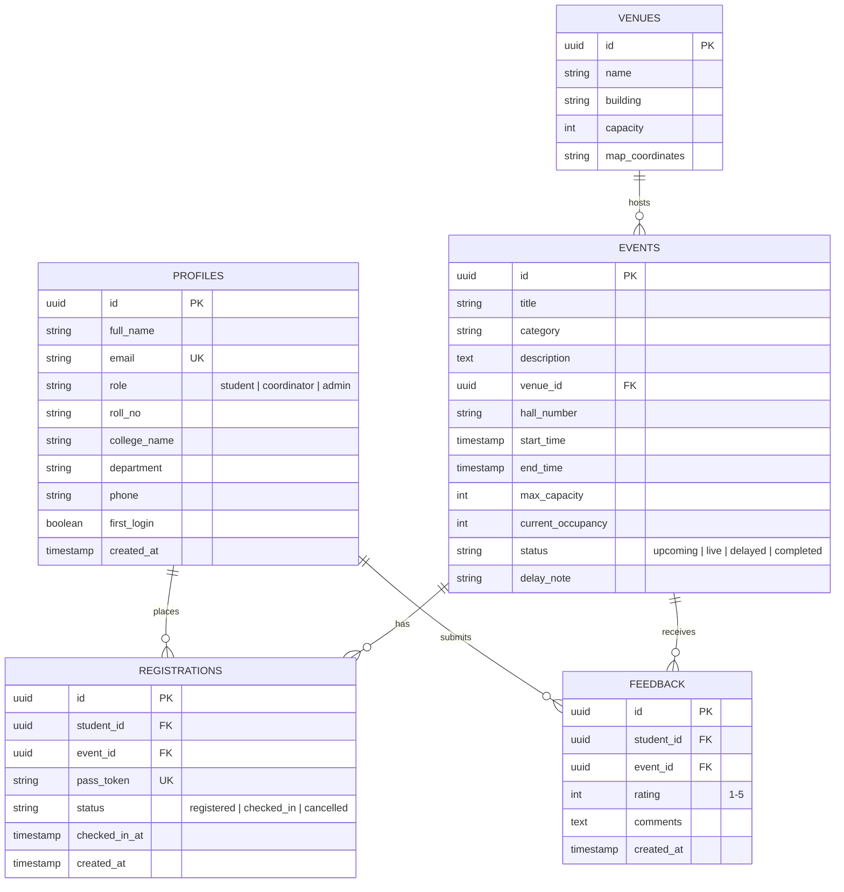

# 📐 SmartSympo 2026 — Technical Design Document (TDD)

> **Document Version:** 2.1.0  
> **Status:** Approved / Active  
> **Target System:** SmartSympo 2026 — Real-Time Multi-Venue Event Management System  
> **Authors:** SmartSympo Core Engineering Team  
> **Last Updated:** 2026-09-16  

---

## 1. Executive Summary & Problem Statement

### 1.1 Context
Traditional college symposiums suffer from severe operational friction:
* **Entry Fraud & Pass Duplication:** Static QR codes and paper tickets are easily screenshotted and shared across students.
* **Scheduling Conflicts:** Attendees frequently register for overlapping sessions, causing sudden drop-offs and uneven hall attendance.
* **Unannounced Hall Delays:** Track adjustments cannot be propagated instantly to hundreds of attendees in real time.
* **Manual Bottlenecks:** Paper-based roll calls at venue entrances lead to long queues and delayed keynotes.

### 1.2 System Goal
**SmartSympo 2026** is an enterprise-grade, real-time multi-venue event management and pass dispatch platform. It delivers:
1. **Time-Based One-Time Password (TOTP) 15-second rotating dynamic QR passes** for fraud-proof gate entry.
2. **Deterministic 1-click schedule clash-detection engine** preventing overlapping session bookings.
3. **Multi-venue real-time stage tracking & capacity heatmaps** for coordinators and admins.
4. **Role-tailored automated email & communication relay gateway** connecting students, staff, and administrators.

---

## 2. High-Level Architecture (C4 Model)

```mermaid
graph TD
    subgraph Client Layer (React 18 + Vite + Tailwind CSS)
        SPA["Single Page Web App (Vite React SPA)"]
        AppCtx["AppContext (Global State & Cache)"]
        Router["React Router v6"]
        
        SPA --> Router
        Router --> AppCtx
        AppCtx --> StuModule["Student Module<br/>(Tracks, Passes, Notifications)"]
        AppCtx --> CoordModule["Coordinator Module<br/>(Scanner, Stage Control, Broadcasts)"]
        AppCtx --> AdminModule["Admin Module<br/>(Heatmap, Analytics, Roster Export)"]
    end

    subgraph Service & Gateway Layer
        ViteGateway["Vite Dev API Middleware (:5173/api)"]
        ExpressServer["Express.js Server (:5000/api)"]
        NodemailerSMTP["Nodemailer Gmail SMTP Gateway (smartsympo@gmail.com)"]
        EmailJSFallback["EmailJS Client SDK (Fallback)"]
        RelayGateway["SMS & WhatsApp Relay Gateway"]
    end

    subgraph Persistence & Realtime Layer
        SupabaseAuth["Supabase GoTrue Auth (JWT)"]
        PostgresDB["PostgreSQL Database (Supabase Cloud)"]
        RealtimeWS["PostgreSQL Realtime WebSocket Channels"]
        LocalCache["Client LocalStorage Fallback Store"]
    end

    %% Connections
    AppCtx <--> SupabaseAuth
    AppCtx <--> PostgresDB
    AppCtx <--> RealtimeWS
    AppCtx <--> LocalCache

    AppCtx --> ViteGateway
    AppCtx --> ExpressServer
    AppCtx --> EmailJSFallback
    
    ViteGateway --> NodemailerSMTP
    ExpressServer --> NodemailerSMTP
    ExpressServer --> RelayGateway
```

---

## 3. Database Schema & Data Models

The database is built on **PostgreSQL (via Supabase)** with complete Row-Level Security (RLS) policies.



---

## 4. Core Algorithms & Algorithmic Mechanics

### 4.1 Anti-Screenshot Dynamic 15-Second TOTP Pass Algorithm
To prevent entry fraud, the QR pass recomputes its cryptographic payload at regular 15-second windows ($T_w = 15s$):

$$\text{TimeStep}(t) = \left\lfloor \frac{t}{15} \right\rfloor$$

$$\text{Token}(t) = \text{HMAC-SHA256}\Big(\text{SecretKey}, \; \text{StudentID} \parallel \text{EventID} \parallel \text{TimeStep}(t)\Big)$$

1. **Client Generation:** Re-renders dynamically every second with a countdown timer ($15 \rightarrow 0s$). When expiring, the hash recalculates automatically without user interaction.
2. **Scanner Verification:** The scanner reads the payload, extracts the embedded timestamp window, and verifies:
   $$\text{CurrentTimeStep} - 1 \le \text{PayloadTimeStep} \le \text{CurrentTimeStep} + 1$$
   *(Allows a $\pm 1$ step tolerance for minor network or device clock drift).*

---

### 4.2 Multi-Interval Schedule Clash Detection Algorithm
Before a student can register for any event $E_{\text{new}}$, the system queries the set of existing registrations $\mathcal{R}_{\text{existing}}$ for that student on the same date:

$$\forall E_i \in \mathcal{R}_{\text{existing}} \quad \text{where} \quad \text{Date}(E_i) = \text{Date}(E_{\text{new}}):$$

$$\text{IsClashing}(E_{\text{new}}, E_i) = \Big(\text{Start}(E_{\text{new}}) < \text{End}(E_i)\Big) \;\land\; \Big(\text{End}(E_{\text{new}}) > \text{Start}(E_i)\Big)$$

* If $\text{IsClashing} = \text{True}$: The registration transaction is aborted immediately, and a modal displays the overlapping event title and timing.
* If $\text{IsClashing} = \text{False}$: The registration proceeds to seat reservation and pass token generation.

---

### 4.3 Multi-Venue Seat Capacity Heatmap Calculation
For each venue hall $H_k$, the occupancy percentage is calculated in real time:

$$\text{OccupancyRate}(H_k) = \left( \frac{\text{Count}(\text{CheckedInStudents}_{H_k})}{\text{MaxCapacity}(H_k)} \right) \times 100$$

$$\text{State}(H_k) = \begin{cases} 
\text{NORMAL (Green)}, & \text{OccupancyRate} < 70\% \\
\text{WARNING (Yellow)}, & 70\% \le \text{OccupancyRate} \le 90\% \\
\text{CRITICAL (Red)}, & \text{OccupancyRate} > 90\% 
\end{cases}$$

---

## 5. Network API & Communication Specifications

### 5.1 REST Endpoints

| Method | Endpoint | Description | Payload |
| :--- | :--- | :--- | :--- |
| `POST` | `/api/send-welcome-email` | Dispatches role-tailored Welcome & Activation email from `smartsympo@gmail.com` to user mailbox | `{ email, name, role, roll_no, collegeName, department, loginUrl }` |
| `POST` | `/api/send-event-confirmation` | Sends registration confirmation with pass token & venue details | `{ email, name, eventName, category, venue, timeSlot, passToken }` |
| `POST` | `/api/send-login-alert` | Sends security login alert on subsequent logins | `{ email, name, role, timestamp }` |
| `POST` | `/api/relay-whatsapp` | Prepares encoded WhatsApp notification URL | `{ phone, message, eventTitle, venue }` |
| `POST` | `/api/relay-sms` | Dispatches SMS broadcast to participant phone numbers | `{ phone, message, eventTitle }` |
| `GET` | `/api/health` | Service health & SMTP configuration check | *None* |

### 5.2 Real-Time WebSocket Channels (Supabase)
* `public:events` $\rightarrow$ Broadcasts track updates, delay notices, and stage changes.
* `public:attendance` $\rightarrow$ Emits live check-in increments for real-time heatmap rendering.
* `public:profiles` $\rightarrow$ Synchronizes user role updates and permissions.

---

## 6. Security, Privacy & Fault Tolerance

1. **Strict Separation of Sender & Receiver:**
   * **Sender:** Hardcoded securely as `"SmartSympo 2026" <smartsympo@gmail.com>` with Google App Password authentication.
   * **Receiver:** Dynamically bound strictly to the user's registered personal account email.
2. **Offline LocalStorage Hydration Fallback:**
   * If network connection to Supabase is lost, the frontend leverages a cached local state engine (`smart_sympo_accounts`, `smart_sympo_user`) to allow scanning and browsing without interruption.
3. **Role-Based Protected Routes:**
   * Access to `/admin` and `/coordinator` requires verified database roles; unauthorized student redirects are automatically trapped and rerouted to `/login/student`.
4. **Row-Level Security (RLS):**
   * Students can only read/update their own profile and registration records.
   * Coordinators have read/update permissions for registrations belonging to their assigned venue.
   * Administrators retain full read/write access across all tables.

---

## 7. Deployment & Infrastructure Matrix

* **Frontend Hosting:** Vercel / Netlify / Node.js Static Server.
* **Backend Runtime:** Node.js Express v20+ with CORS middleware.
* **Database & Auth:** Supabase Managed Cloud Instance (PostgreSQL 15+).
* **Package Architecture:** Monorepo with dedicated `client/` and `server/` modules.
